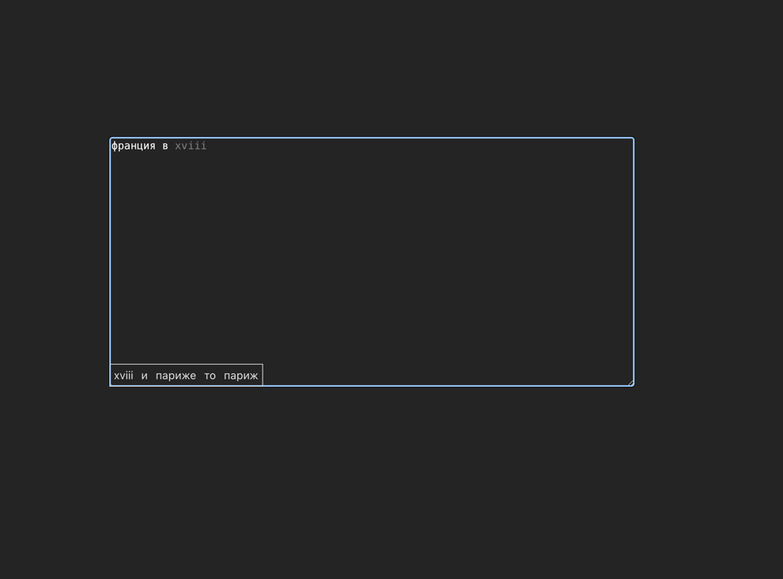

# Autocomplete

A lightweight, framework-free next-word autocomplete for `<textarea>`, written in TypeScript.
As you type, an N-gram language model predicts the most likely next words and renders them as
inline "ghost text" — press **Tab** to accept the top suggestion.

The model is trained on the fly from Russian Wikipedia articles and runs entirely in the browser.

**🔗 Live demo: https://alextorq.github.io/textarea-autocomplete/**



## How it works

The prediction engine is an **N-gram language model with Stupid Backoff** smoothing
(Brants et al., 2007). Instead of returning zero probability when an N-gram is unseen, it
"backs off" to the shorter `(N-1)`-gram and multiplies the score by a fixed factor `alpha = 0.4`:

```
S(w | h) = count(h + w) / count(h)        if the N-gram was seen
         = alpha * S(w | h')              otherwise (h' is the context with its first word dropped)
```

By default the model uses 4-grams (`order = 4`).

### Pipeline

1. **Tokenizer** (`AdvancedTokenizer`) — normalizes text (NFC, lowercase, `ё → е`), splits it into
   words for Russian/English/digits via Unicode property escapes, and inserts sentence markers
   (`<S>` / `</S>`). Words are mapped to integer IDs to keep storage and hashing fast.
2. **N-gram store** (`NGramStore`) — a sparse counter that records only the N-grams it has seen.
   It also keeps a `context → candidates` map so prediction never has to scan the whole vocabulary.
3. **Model** (`StupidBackoffModel`) — collects candidates for the current context (backing off the
   context as needed), scores each one, and returns the top-K suggestions.

### Two-tier sources

The model keeps **two independent stores** so a user's own writing can outweigh the general corpus:

- `GENERAL` — trained from the Wikipedia corpus on startup.
- `USER` — reserved for text the user types (higher priority during candidate lookup).

An alternative **PPM** (Prediction by Partial Matching) implementation lives under
`src/models/PPM/` for comparison; the active model is selected in `src/models/index.ts`.

## Project structure

```
src/
├── main.ts                       # Entry point: wires the textarea to the model, loads training data
├── api/index.ts                  # Fetches article extracts from the Russian Wikipedia API
├── models/
│   ├── index.ts                  # modelAbstractFactory() — picks the active model
│   ├── interface.ts              # IAutoCompleter / Suggestion contracts
│   ├── source.ts                 # GENERAL / USER source enum
│   ├── stupid-backoff/           # Active model: tokenizer, n-gram store, scoring
│   └── PPM/                       # Alternative PPM model
└── ui/
    ├── textarea/                 # Textarea component + suggestion box, Tab-to-accept
    └── placeholder/              # Ghost-text overlay (PersistentPlaceholder)
```

## Getting started

Requirements: Node.js 18+.

```bash
npm install      # install dependencies
npm run dev      # start the Vite dev server
npm run build    # type-check (tsc) and build for production
npm run preview  # preview the production build
```

Open the URL printed by `npm run dev` and start typing. After a sentence or two the model warms
up, ghost text appears, and **Tab** completes the current suggestion.

> Note: training data is fetched from `ru.wikipedia.org` at startup, so an internet connection is
> required on first load. The set of articles is configured in `src/main.ts`.

## Tech stack

- **TypeScript** (strict mode)
- **Vite** (via `rolldown-vite`) for dev server and bundling
- No UI framework — plain DOM APIs

## Customization

- **Change the corpus** — edit the `articles` array in `src/main.ts`.
- **Change the N-gram order** — adjust the `order` argument in `src/models/stupid-backoff/index.ts`.
- **Swap the model** — return a different `IAutoCompleter` from `modelAbstractFactory()` in
  `src/models/index.ts` (e.g. the PPM implementation).
